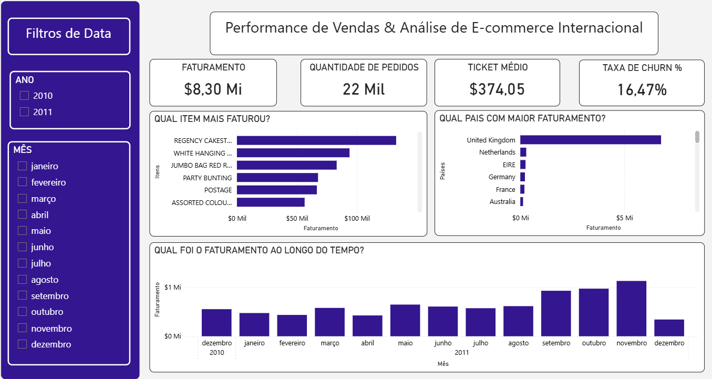
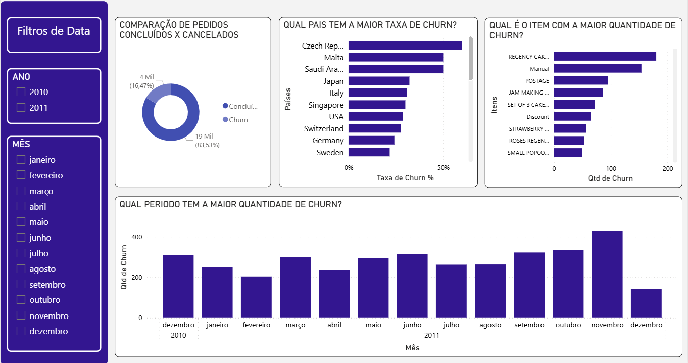

🚀 Análise de E-commerce Internacional: Performance & Churn

📌 Sobre o Projeto

Este projeto foi desenvolvido para transformar dados transacionais brutos em inteligência de negócio. O foco principal é entender o Faturamento Global e diagnosticar a saúde da operação através da Taxa de Churn (Cancelamentos).

A solução cobre desde o tratamento inicial dos dados até a entrega de dashboards dinâmicos para diretoria e gerência operacional.

🛠️ Stack Tecnológica
<table>
<tr>
<td><b>Linguagem</b></td>
<td>Python (Pandas, NumPy)</td>
</tr>
<tr>
<td><b>Banco de Dados</b></td>
<td>PostgreSQL</td>
</tr>
<tr>
<td><b>Visualização</b></td>
<td>Power BI (DAX)</td>
</tr>
<tr>
<td><b>Modelagem</b></td>
<td>Star Schema (Tabelas Fato e Dimensões)</td>
</tr>
</table>

📊 Principais Indicadores (KPIs)

Faturamento Total: Visão macro da receita bruta.

Total de Pedidos: Contagem única de faturas para precisão métrica.

Taxa de Churn: Percentual de pedidos cancelados vs. concluídos.

Distribuição Geográfica: Identificação dos mercados mais lucrativos e mais problemáticos.

🔍 Insights Estratégicos Obtidos

Foco em Retenção: Identificamos que 16,47% dos pedidos são cancelados globalmente.

Alerta Logístico: A República Tcheca apresenta um churn crítico de quase 60%, sugerindo problemas de entrega ou meios de pagamento locais.

Ticket Médio: O valor médio por fatura ($374,05) serve como base para novas metas de cross-sell.

🖥️ Visualização do Dashboard

1. Performance de Vendas
Visão geral de faturamento, ticket médio e itens mais vendidos.

2. Diagnóstico de Churn
Análise profunda sobre onde e por que os cancelamentos ocorrem.

📂 Estrutura do Repositório

/dashboard: Arquivo .pbix original do Power BI.

/scripts: Código Python utilizado no processo de ETL.

/images: Arquivos de imagens do Dashboard.
